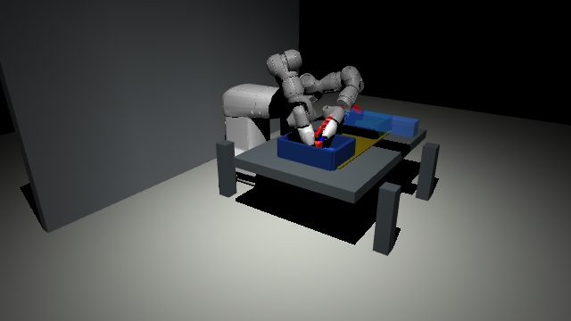
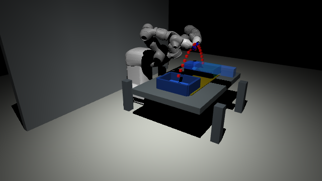
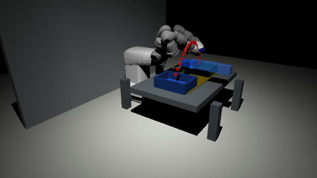

# EPT2 YuMi Flexible Cobot Demo

这是一个基于 ABB YuMi 与 MuJoCo 的课堂展示型仿真 demo，用来对比两种人机协作方式：

- `traditional`: 人手进入工位风险区域后，机器人直接暂停，等待风险消失后继续。
- `flexible`: 机器人显示人手预测轨迹，动态抬高搬运轨迹并平滑降速，在不中断任务的情况下避让。

当前 demo 的核心不是“真实夹取物理精度”，而是把“传统停机协作”和“柔性共生协作”的差异做成可运行、可观察、可讲解的 A/B 演示。

## 效果预览

| Traditional: Stop-and-Go | Flexible: Predict and Yield |
| --- | --- |
|  |  |



图中主要视觉元素：

- 灰色机器人：ABB YuMi 双臂模型。
- 蓝色和绿色箱体：左侧取物箱、右侧放物箱。
- 红色方块：被搬运物体。
- 红色点列：夹爪/物体搬运轨迹。
- 黄色透明区域：人手侵入后会触发风险判断的工作区。
- 蓝色半透明长方体：从正面伸入的人手代理。
- 蓝色点列：`flexible` 场景下显示的人手预测轨迹。

## 快速开始

项目依赖 `uv`，并在 `pyproject.toml` 中锁定 Python `3.9.6` 与 `mujoco==3.3.7`。

```bash
cd "/Users/ryanjoy/Desktop/Project/工程技术实践II/EPT2_Demo"
uv sync
```

先跑无窗口检查：

```bash
uv run yumi-mujoco-demo --headless --list-joints
uv run yumi-mujoco-demo --scenario traditional --headless --duration 8
uv run yumi-mujoco-demo --scenario flexible --headless --duration 8
```

打开 MuJoCo 窗口：

```bash
uv run yumi-mujoco-demo --scenario traditional
uv run yumi-mujoco-demo --scenario flexible
```

macOS 下如果普通 Python 无法启动 MuJoCo viewer，使用 MuJoCo 提供的 `mjpython`：

```bash
.venv/bin/mjpython yumi_mujoco_demo.py --scenario flexible
```

如果 `.venv/bin/mjpython` 报 `bad interpreter`，通常是虚拟环境来自旧路径，重建即可：

```bash
rm -rf .venv
uv sync
```

## 命令参数

```bash
uv run yumi-mujoco-demo --help
```

常用参数：

- `--scenario {traditional,flexible}`: 选择传统停机或柔性避让场景，默认 `traditional`。
- `--headless`: 不打开 GUI，只运行仿真循环，适合快速验证。
- `--duration <秒>`: 运行指定秒数；GUI 模式下到时自动退出。
- `--list-joints`: 打印 MuJoCo 关节表，包括关节索引、`qpos` 地址和关节限位。
- `--speed <倍率>`: 任务速度倍率，默认 `1.02`。
- `--amplitude <倍率>`: 搬运轨迹高度和柔性避让幅度倍率，内部限制在 `0.6` 到 `1.35`。

示例：

```bash
uv run yumi-mujoco-demo --scenario flexible --speed 0.8 --amplitude 1.2
uv run yumi-mujoco-demo --scenario traditional --headless --duration 3 --list-joints
```

## 当前实现

运行入口是 `yumi_mujoco_demo.py`，实际逻辑拆在 `yumi_mujoco/` 包中。

| 文件 | 作用 |
| --- | --- |
| `yumi_mujoco/runner.py` | 命令行参数、headless 循环、viewer 循环 |
| `yumi_mujoco/robot_loader.py` | 复制 YuMi STL，生成 MuJoCo 可读 URDF，并编译模型 |
| `yumi_mujoco/scene_builder.py` | 追加地面、背景墙、工作台、灯光、相机 |
| `yumi_mujoco/pick_place_scene.py` | 左右箱、红色物体、轨迹点、风险区域 |
| `yumi_mujoco/human_proxy.py` | 人手代理、侵入路径、风险等级、预测轨迹 |
| `yumi_mujoco/scenarios.py` | `traditional` 与 `flexible` 两套 A/B 逻辑 |
| `yumi_mujoco/pick_place_controller.py` | 双夹爪搬运状态机、轻量 IK、抓取锁定 |
| `yumi_mujoco/robot_state.py` | 关节名、关节限位、预留初始姿态工具和关节表打印 |
| `yumi_mujoco/paths.py` | 项目路径、源 URDF、生成目录和 mesh 搜索路径 |

加载流程：

1. 从 `yumi/yumi_description/urdf/yumi.urdf` 读取 YuMi 原始 URDF。
2. 把 URDF 中的 `package://yumi_description/...` mesh 引用改成 MuJoCo 能直接读取的本地文件名。
3. 将需要的 STL 复制到 `.generated/`。
4. 用 `mujoco.MjSpec.from_file(...)` 载入机器人，再通过代码追加工作站、人手代理和场景元素。
5. 编译为 `MjModel` / `MjData` 后进入 headless 或 viewer 循环。

`.generated/` 是运行时产物，可以删除；下次运行会自动重新生成。

## A/B 场景逻辑

### Traditional

`TraditionalScenario` 会更新人手位置，但不显示预测轨迹。只要人手进入风险区域，并且搬运任务处在关键阶段，控制器就暂停 `task_time`：

- 机器人停在当前红色轨迹附近。
- 物体和夹爪不继续向目标箱移动。
- 风险消失后继续执行原来的取放节奏。

这个场景表达的是传统安全协作：足够安全，但任务会被中断。

### Flexible

`FlexibleScenario` 会显示预测轨迹，并把人手风险等级平滑混入控制器：

- 风险越高，机器人速度越低，最多降低约 35%。
- 风险越高，红色搬运轨迹越高，最高额外抬高约 `0.16m * amplitude`。
- 控制器不暂停任务，而是持续完成左箱取物、右箱放物。

这个场景表达的是柔性共生协作：机器人不是简单停下，而是预测人的运动并调整自己的路径。

## 搬运动作状态机

`PickPlaceController` 每轮循环约 `4.9s`，状态依次为：

```text
WAIT_AT_LEFT -> APPROACH_LEFT -> GRASP_LOCK -> LIFT_FROM_LEFT
-> TRANSFER -> LOWER_TO_RIGHT -> RELEASE -> RESET
```

双臂末端通过轻量级位置 IK 向目标点移动，夹爪开合由 `qpos` 写入控制。红色物体虽然是 MuJoCo free joint 物体，但在抓取和搬运阶段会跟随夹爪中心路径，以保证课堂演示稳定、清楚。

## 项目资源说明

- `yumi/` 是 ABB YuMi 的 ROS/URDF 模型与 mesh 资源，本地用于仿真加载。
- `yumi/`、`.generated/`、`.venv/` 和 `*.egg-info/` 都被 `.gitignore` 排除，避免把大模型资源和本地环境提交进仓库。
- 如果把项目复制到新机器，需要保证 `yumi/yumi_description/urdf/yumi.urdf` 和对应 `meshes/` 存在。
- `docs/media/` 存放 README 用截图素材。

## 已验证命令

本 README 更新时已验证：

```bash
uv run yumi-mujoco-demo --headless --list-joints
uv run yumi-mujoco-demo --scenario traditional --headless --duration 1
uv run yumi-mujoco-demo --scenario flexible --headless --duration 1
uv run yumi-mujoco-demo --help
```

`--list-joints` 当前可打印 20 个 MuJoCo joint，其中包含 14 个 YuMi 双臂关节、4 个夹爪关节、红色物体 free joint 和人手代理 free joint。

## 当前边界

这个 demo 是稳定课堂展示原型，不是工业级抓取控制器。当前重点是“协作策略对比”而不是接触力学真实性：

- 没有建真实 actuator 控制闭环。
- 没有依赖摩擦和接触力完成物理夹取。
- 没有传感器噪声、视觉识别、任务成功率统计。
- 人手是几何代理，不是真人动作捕捉数据。

如果后续要升级为更真实的机器人控制实验，可以继续补 actuator、接触参数、传感器反馈、轨迹规划器和成功率评估模块。
